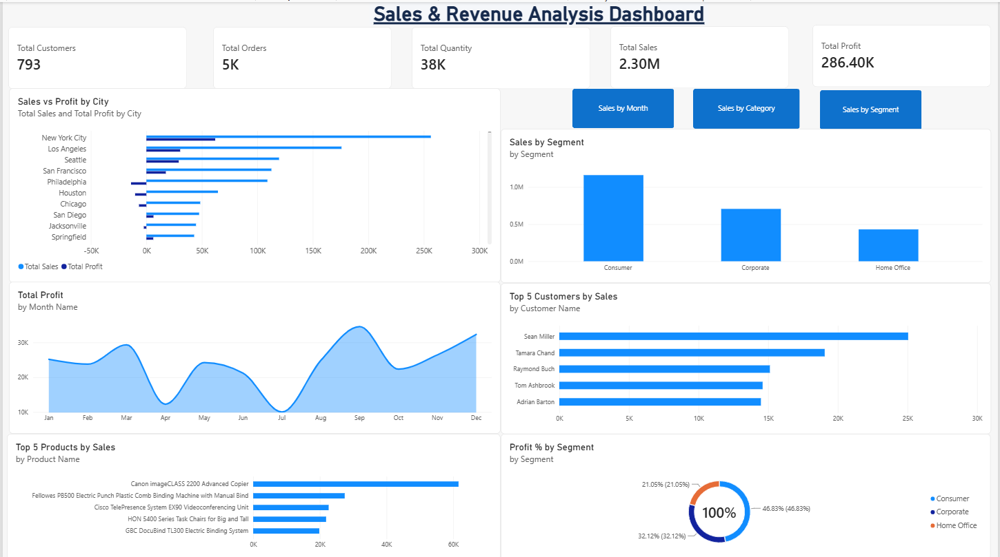

# Sales & Revenue Analysis Dashboard

## 📊 Dashboard Screenshot

## 📌 Project Description

The Sales & Revenue Analysis Dashboard is an interactive Power BI dashboard developed to analyze sales performance, revenue trends, customer performance, product performance, and profitability.

The dashboard provides an easy-to-understand visual representation of key business metrics and allows users to explore sales data through interactive charts, filters, and slicers.

## 🚀 Key Features

- Total Sales, Profit, Customers, Orders, and Quantity KPIs
- Monthly sales and profit trend analysis
- Top 5 customers by sales
- Top 5 products by sales
- Profit percentage analysis by customer segment
- Sales analysis by:
  - Month
  - Category
  - Segment
- Interactive buttons for switching between different sales views
- Interactive Power BI visualizations for business insights

## 🛠️ Tools Used

- **Microsoft Power BI Desktop** – Dashboard development and visualization
- **Power Query** – Data preparation and transformation
- **CSV Dataset** – Source data
- **DAX** – KPI and analytical measures

## 📈 Key KPIs

| KPI | Value |
|---|---:|
| Total Customers | 793 |
| Total Orders | 5K |
| Total Quantity | 38K |
| Total Sales | 2.30M |
| Total Profit | 286.40K |

## 📁 Project Files

- `Sales_Revenue_Analysis_Dashboard.pbix` – Power BI dashboard file
- `README.md` – Project documentation

## 👨‍💻 Project

Developed as part of an internship task on **Sales & Revenue Analysis using Power BI**.
